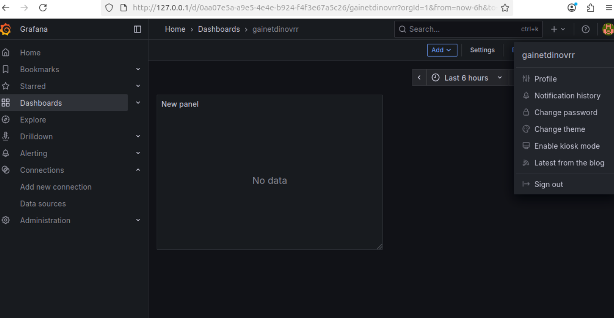

1. Docker Compose — это инструментальное средство, входящее в состав Docker. Оно разработано для помощи в определении и совместном использовании многоконтейнерных приложений. С помощью Docker Compose можно создать 1 YAML-файл для определения служб и с помощью одной команды запустить и остановить все, что нужно при развертывании многоконтейнерных приложений.

Задания 2-7: 
---prometheus.yml---

<h>global:
  scrape_interval: 15s
  evaluation_interval: 15s

alerting: 
  alertmanagers:
    - static_configs:
      - targets:

rule_files: 
scrape_configs:
  - job_name: 'prometheus'
    static_configs:
      - targets: ["localhost:9090"]

  - job_name: 'pushgateway'
    honor_labels: true
    static_configs:
      - targets: ["pushgateway:9091"]</h>
---grafana---
<h>
[security]
admin_user = gainetdinovrr
admin_password = netology

[server]
http_port = 3000
</h>
---docker-compose.yml---

<h>
version: '3.8'

services:
  prometheus:
    image: prom/prometheus:latest
    container_name: gainetdinovrr-prometheus
    ports:
      - "9090:9090"
    volumes:
      - ./prometheus/prometheus.yml:/home/herusl/hw-6-04/prometheus/prometheus.yml
      - prometheus_data:/prometheus
    networks:
      - gainetdinovrr-my-netology-hw
    restart: unless-stopped
    depends_on:
      - pushgateway
  pushgateway:
    image: prom/pushgateway:latest
    container_name: gainetdinovrr-pushgateway
    ports:
      - "9091:9091"
    networks:
      - gainetdinovrr-my-netology-hw
    restart: unless-stopped
  grafana:
    image: grafana/grafana:latest
    container_name: gainetdinovrr-grafana
    ports:
      - "80:3000"
    volumes:
      - ./grafana/grafana.ini:/home/herusl/hw-6-04/grafana/grafana.ini
      - grafana_data:/var/lib/grafana
    environment:
      - GF_PATHS_CONFIG=/home/herusl/hw-6-04/grafana/grafana.ini
    networks:
    
      - gainetdinovrr-my-netology-hw
    restart: unless-stopped
    depends_on:
      - prometheus

volumes:
  prometheus_data:
  grafana_data:

networks:
  gainetdinovrr-my-netology-hw:
    driver: bridge
    ipam:
      config:
        - subnet: 10.5.0.0/16
</h>

Grafana+Prometheus

Остановка контейнеров: docker-compose down