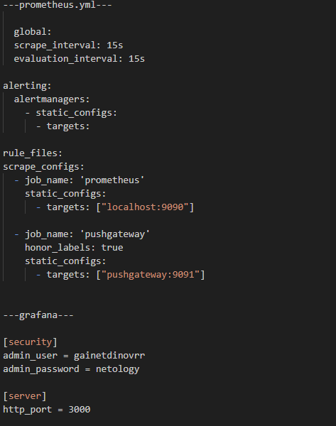
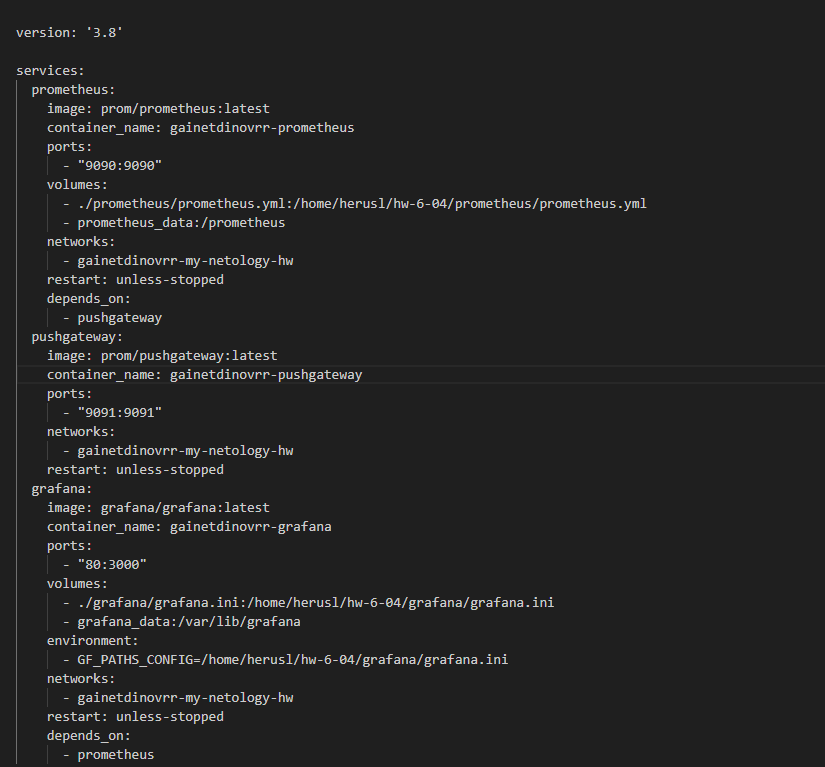
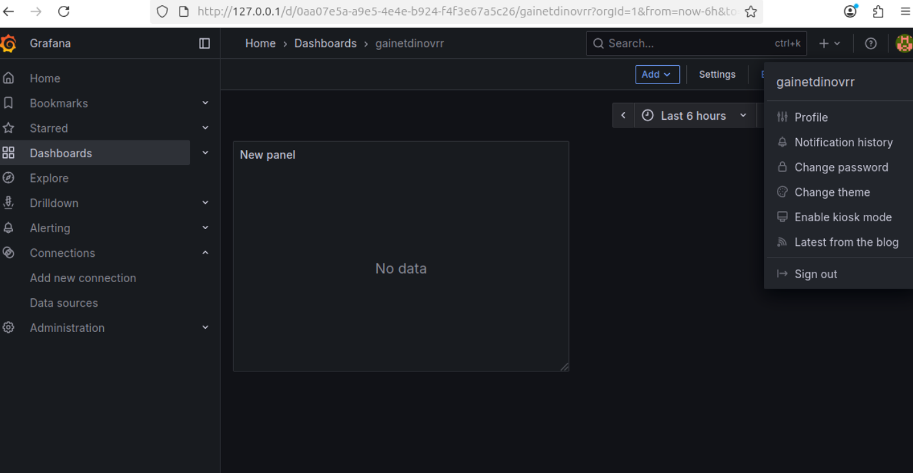

1:

Docker Compose — это инструментальное средство, входящее в состав Docker. Оно разработано для помощи в определении и совместном использовании многоконтейнерных приложений. С помощью Docker Compose можно создать 1 YAML-файл для определения служб и с помощью одной команды запустить и остановить все, что нужно при развертывании многоконтейнерных приложений.

Задания 2-7: 

---prometheus.yml, pushgateway, grafana.ini---

---docker-compose.yml---

Grafana+Prometheus

Остановка контейнеров: docker-compose down