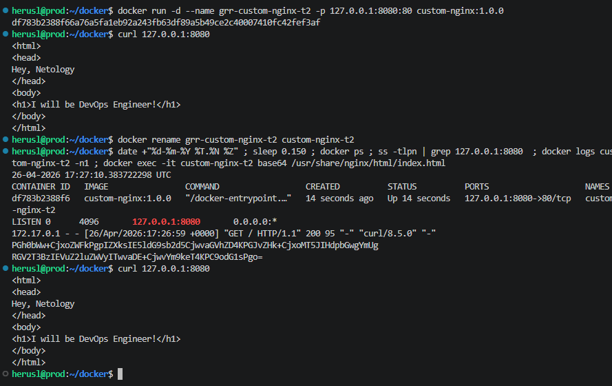
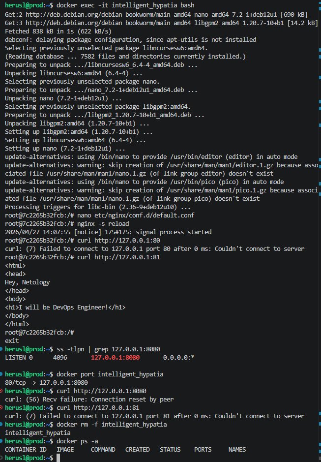
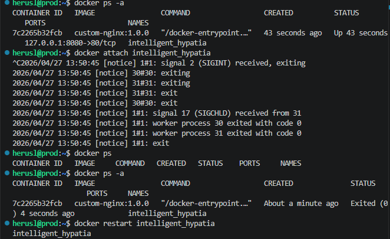
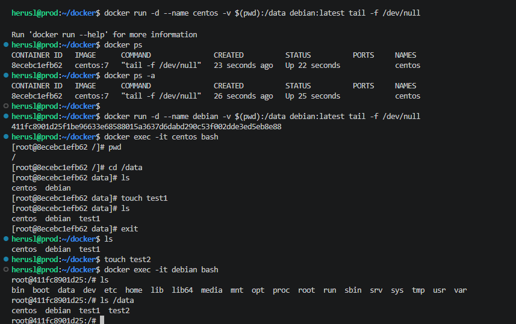
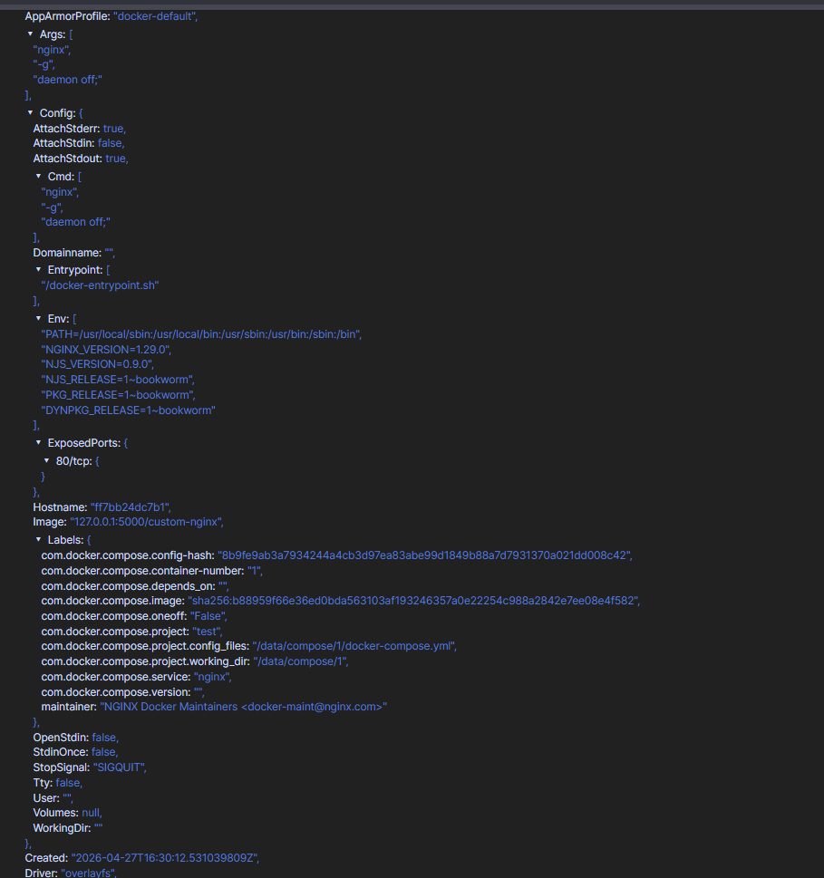
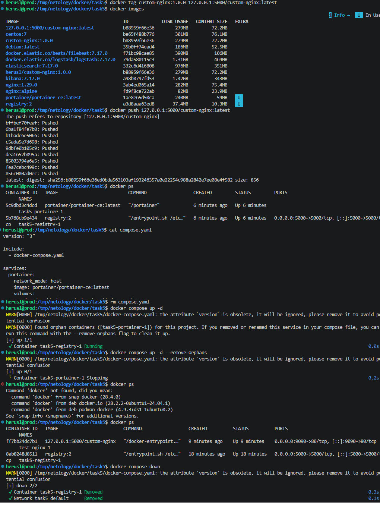

# Домашнее задание к занятию "`«Оркестрация группой Docker контейнеров на примере Docker Compose»`" - `grr`

### Задание 1

https://hub.docker.com/repository/docker/herusl/custom-nginx/general

### Задание 2

### Задание 3

1. При подключении к стандартному потоку командой attach, мы зашли в единственный процесс, которым и являлся сервер nginx, после остановки соответственно процессов не осталось и контейнер завершил работу.
2. Суть проблемы со сменой порта заключается в том, что при запуске мы указали, что весь трафик на 8080 хоста отправь на 80 порт контейнера. Изменив порт внутри контейнера в логике самого докера ничего не изменилось и он не знает про 81 порт, который слушает теперь nginx. Решить можно пробросом портов разными утилитами/конфигами.

### Задание 4

### Задание 5

