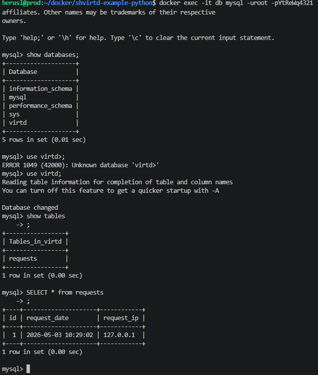
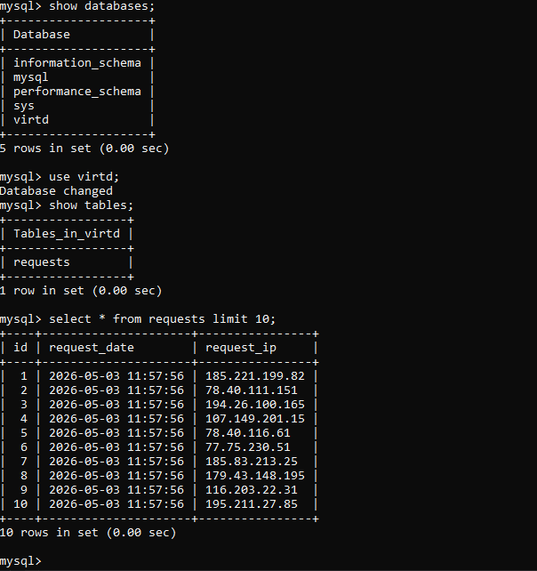
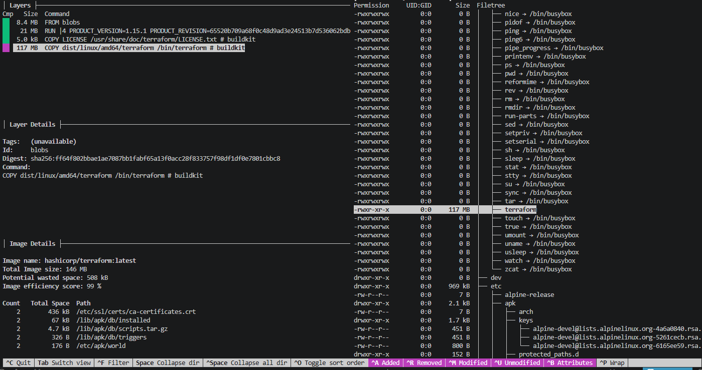
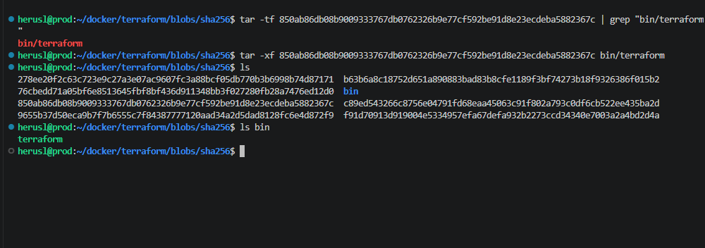
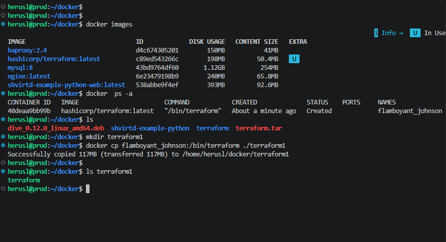

# Домашнее задание к занятию "`«Практическое применение Docker»`" - `grr`
### Задание 1

Ссылка на форк: https://github.com/kamajina/shvirtd-example-python/tree/main

### Задание 3

### Задание 4

### Задание 6

