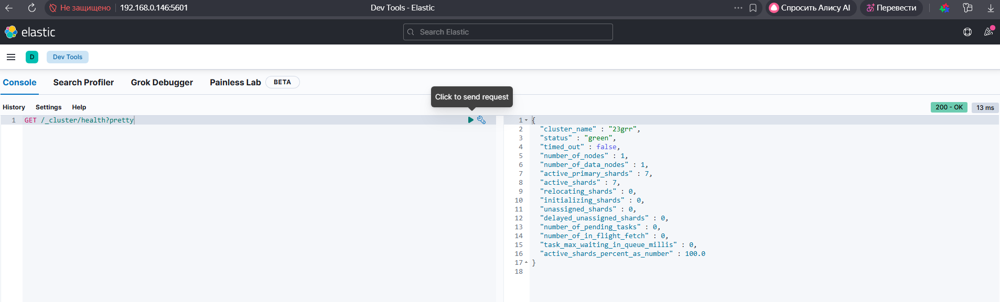
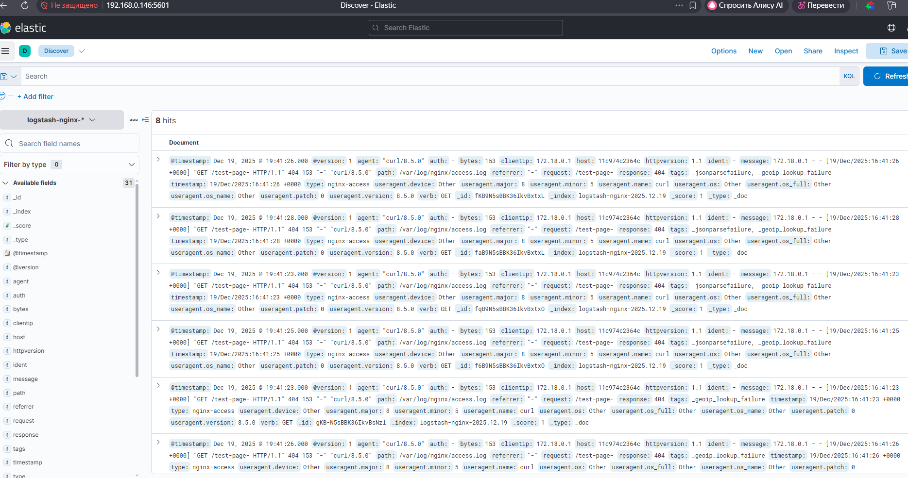
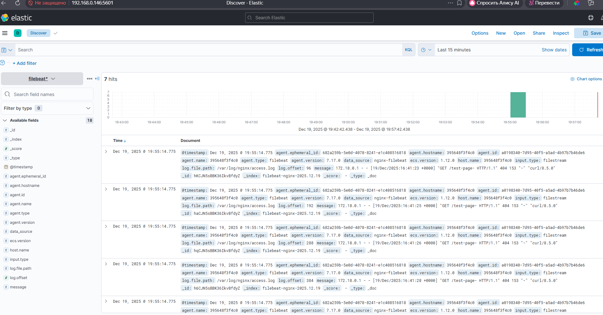

# Домашнее задание к занятию "`«ELK»`" - `grr`
### Задание 1


### Задание 2




### Задание 3



### Задание 4




docker compose conf:
```
services:

  elasticsearch:
    image: elasticsearch:7.17.0
    container_name: elasticsearch
    environment:
      - xpack.security.enabled=false
      - discovery.type=single-node
      - cluster.name=23grr
    ulimits:
      memlock:
        soft: -1
        hard: -1
      nofile:
        soft: 65536
        hard: 65536
    cap_add:
      - IPC_LOCK
    volumes:
      - elasticsearch_data:/usr/share/elasticsearch/data
    ports:
      - 9200:9200
      - 9300:9300
    networks:
      - elk
  kibana:
    container_name: kibana
    image: kibana:7.17.0
    environment:
      - ELASTICSEARCH_HOSTS=http://elasticsearch:9200
    ports:
      - 5601:5601
    depends_on:
      - elasticsearch
    networks:
      - elk
  logstash:
    image: docker.elastic.co/logstash/logstash:7.17.0
    container_name: logstash
    environment:
      - XPACK_MONITORING_ENABLED=false
    volumes:
      - ./logstash/pipeline:/usr/share/logstash/pipeline
      - ./nginx/logs:/var/log/nginx
    ports:
      - "5044:5044"
      - "5000:5000"
    networks:
      - elk
    depends_on:
      - elasticsearch
    restart: unless-stopped
  nginx:
    image: nginx:alpine
    container_name: nginx
    ports:
      - "8080:80"
    volumes:
      - ./nginx/logs:/var/log/nginx 
      - ./nginx/conf.d:/etc/nginx/conf.d
      - ./nginx/html:/usr/share/nginx/html  
    networks:
      - elk
    restart: unless-stopped
 
  filebeat:
    image: docker.elastic.co/beats/filebeat:7.17.0
    container_name: filebeat
    user: root 
    volumes:
      - ./filebeat/filebeat.yml:/usr/share/filebeat/filebeat.yml:ro 
      - ./nginx/logs:/var/log/nginx:ro
      - /var/lib/docker/containers:/var/lib/docker/containers:ro
      - /var/run/docker.sock:/var/run/docker.sock
    depends_on:
      - elasticsearch
      - kibana
    networks:
      - elk
    restart: unless-stopped
networks:
  elk:
    driver: bridge

volumes:
  elasticsearch_data:
    driver: local
```

