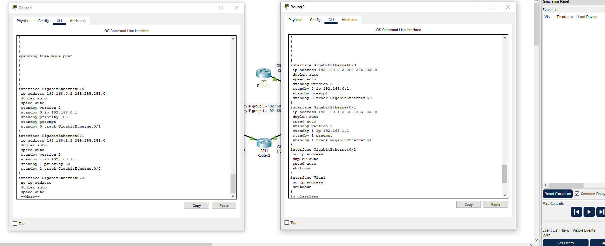
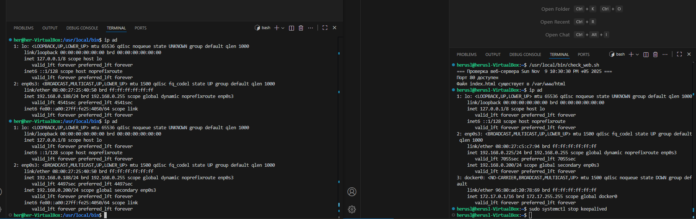

# Домашнее задание к занятию "`«Disaster Recovery. FHRP и Keepalived»`" - `grr`
### Задание 1



[hsrp](https://github.com/kamajina/sys-pattern-homework/blob/main/keepalived/hsrp_advanced_hw.pkt)


### Задание 2

```
(#!/bin/bash)

WEB_PORT=80
DOCUMENT_ROOT="/var/www/html"
INDEX_FILE="index.html"

check_port() {
    if nc -z localhost $WEB_PORT &>/dev/null; then
        echo "Порт $WEB_PORT доступен"
        return 0
    else
        echo "ОШИБКА: Порт $WEB_PORT недоступен"
        return 1
    fi
}

check_index_file() {
    if [[ -f "$DOCUMENT_ROOT/$INDEX_FILE" ]]; then
        echo "Файл $INDEX_FILE существует в $DOCUMENT_ROOT"
        return 0
    else
        echo "ОШИБКА: Файл $INDEX_FILE отсутствует в $DOCUMENT_ROOT"
        return 1
    fi
}

main() {
    echo "Проверка веб-сервера $(date)"
    
    # Проверяем порт
    if ! check_port; then
        exit 1
    fi
    
    # Проверяем файл index.html
    if ! check_index_file; then
        exit 1
    fi
}

main
```
```
global_defs {
    router_id LVS_DEVEL
}


vrrp_script check_web {
    script "/usr/local/bin/check_web.sh"
    interval 3 
    weight -50  
    fall 2    
    rise 1     
}

vrrp_instance VI_1 {
        state MASTER
        interface enp0s3
        virtual_router_id 15
        priority 255
        advert_int 1

        virtual_ipaddress {
              192.168.0.200/24
        }


        track_script {
               check_web_server
        }
}
```

Пояснение к скриншоту\
Справа мастер, слева бэкап\
Запустил сервис keepalived на обоих серверах, мастер взял по приоритету secondary VIP\
Остановил службу на мастере\
На бэкап перешел secondary VIP\

