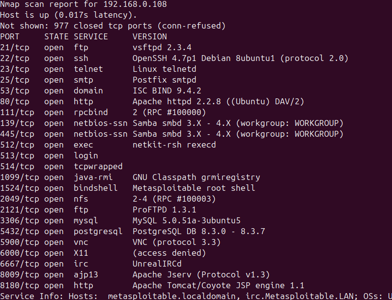
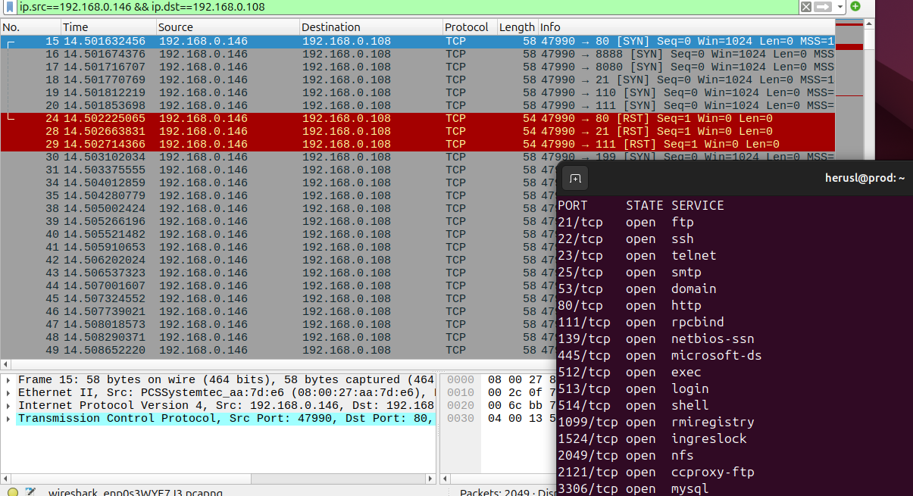
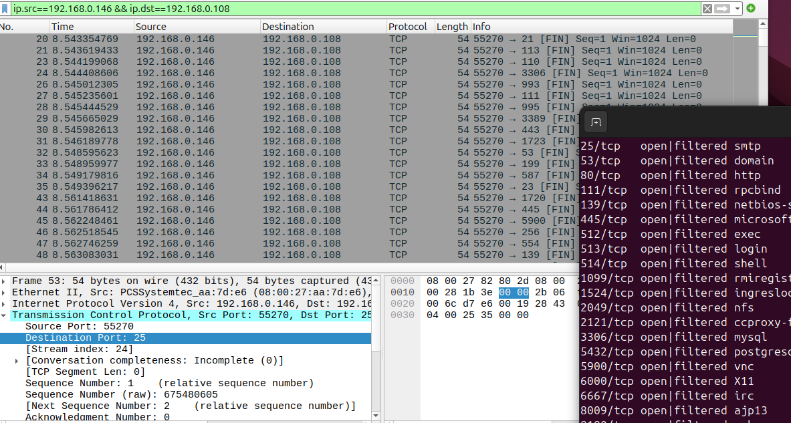
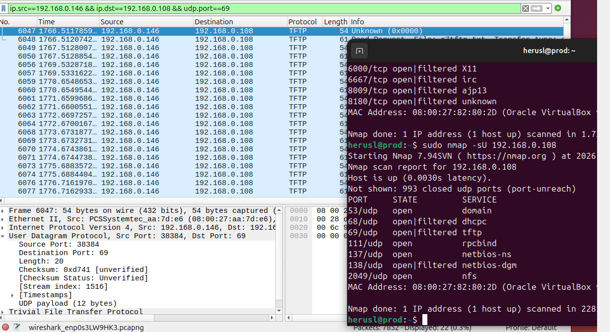

# Домашнее задание к занятию "`«Уязвимости и атаки на информационные системы»`" - `grr`
Задание 1
Скачайте и установите виртуальную машину Metasploitable: https://sourceforge.net/projects/metasploitable/.

Это типовая ОС для экспериментов в области информационной безопасности, с которой следует начать при анализе уязвимостей.

Просканируйте эту виртуальную машину, используя nmap.

Попробуйте найти уязвимости, которым подвержена эта виртуальная машина.

Сами уязвимости можно поискать на сайте https://www.exploit-db.com/.

Для этого нужно в поиске ввести название сетевой службы, обнаруженной на атакуемой машине, и выбрать подходящие по версии уязвимости.

Ответьте на следующие вопросы:

Какие сетевые службы в ней разрешены?
Какие уязвимости были вами обнаружены? (список со ссылками: достаточно трёх уязвимостей)
Приведите ответ в свободной форме.

Задание 2
Проведите сканирование Metasploitable в режимах SYN, FIN, Xmas, UDP.

Запишите сеансы сканирования в Wireshark.

Ответьте на следующие вопросы:

Чем отличаются эти режимы сканирования с точки зрения сетевого трафика?
Как отвечает сервер?
Приведите ответ в свободной форме.

### Задание 1
 \
https://www.exploit-db.com/exploits/49757 \
https://www.exploit-db.com/exploits/30020 \
https://www.exploit-db.com/exploits/32849 

### Задание 2

SYN - Не устанавливает соединение полное TCP соединение, при нахождении открытого порта посылает RST и закрывает соединения, оповещая об открытом порте\
 \
FIN - Отправка TCP FIN с имитацией установленного соединения, открытые порты игнонируются, закрытые - RST\
 \
Xmas - Отправка FIN+PSH+URG, легче детектируется, ответы как и при FIN\
 \
UDP - Посылает ICMP и ждет ответа с таймаутами, закрытые порты отвечают ICMP Port Unreachable
 \
