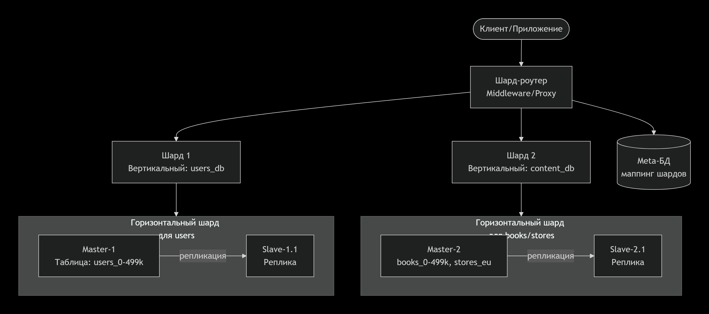

# Домашнее задание к занятию "`«Replication MySQL 2»`" - `grr`
### Задание 1
Активный master и пассивный slave:
slave служит «горячей» резервной копией для быстрого восстановления при сбое master.
Разгрузка master для задач чтения, которые можно выполнять на slave.
Безопасное резервное копирование без остановки основной БД с бэкапами на slave.
Простота администрирования благодаря чёткому разделению ролей и односторонней репликации.

Master и несколько slave:
Нагрузка по запросам распределяется между несколькими slave, что позволяет обслуживать больше пользователей.
slave можно разместить в разных регионах для уменьшения задержки у локальных пользователей.
При падении одного slave остальные продолжают обслуживать запросы, повышая отказоустойчивость.
Выделенные slave под разные задачи.
### Задание 2
1. Принципы построения

Вертикальный шардинг:
Таблицы с разной функциональностью размещаются на отдельных серверах.
Пример: сервер users_db (таблица users), сервер content_db (таблицы books, stores).
Уменьшает нагрузку на дисковые подсистемы и память каждого сервера, повышает безопасность
Горизонтальный шардинг:
Данные одной таблицы распределяются между серверами по ключу шардинга.
Пример: users шардируются по user_id, books по book_id, stores по региону.

2. Режимы работы серверов

Master-Slave репликация внутри каждого шарда для обеспечения отказоустойчивости и балансировки чтения.
Шард-серверы работают в режиме Multi-Master между собой не реплицируются, только координация через шард-контроллер.
Отдельный шард-роутер определяет на какой шард направлять запрос.

3. Разбивка таблиц по базам

Вертикальное разделение:

Сервер Шард-группы 1: users_db (только таблица users).
Сервер Шард-группы 2: content_db (таблицы books, stores).

Горизонтальное разделение внутри групп:

users: по диапазону user_id (например, users_0, users_1).
books: по диапазону book_id или хэшу от author_id.
stores: по региону (stores_eu, stores_usa, stores_asia).

/