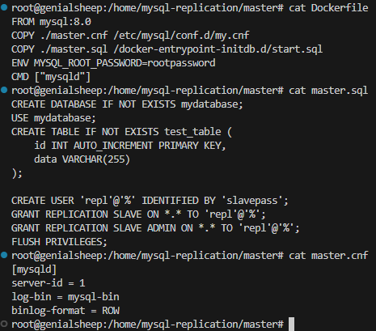
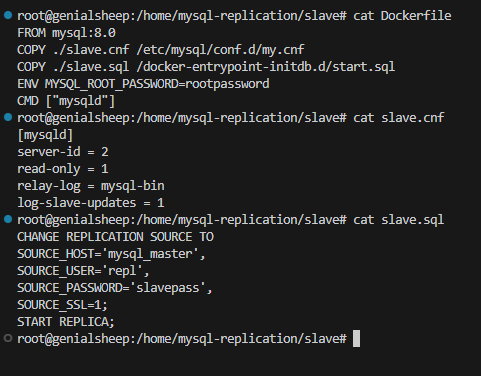
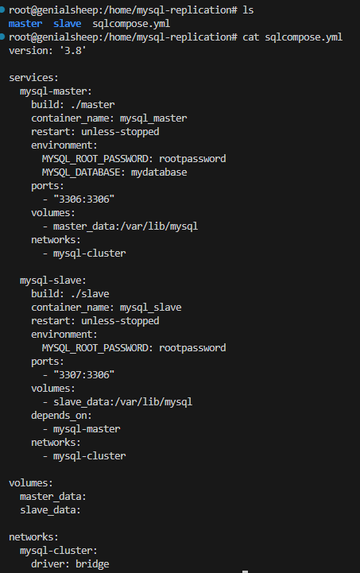
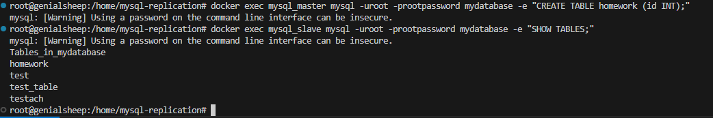

# Домашнее задание к занятию "`«Replication MySQL»`" - `grr`
### Задание 1
Master-Slave: Однонаправленная репликация. Единственный источник истины (Master), данные только с него реплицируются на один или несколько подчиненных серверов (Slave). Запись — только на Master.\
Master-Master: Двунаправленная репликация. Каждый сервер (Master) является и источником, и получателем данных. Запись возможна на любой узел.\

### Задание 2

\
\
\

