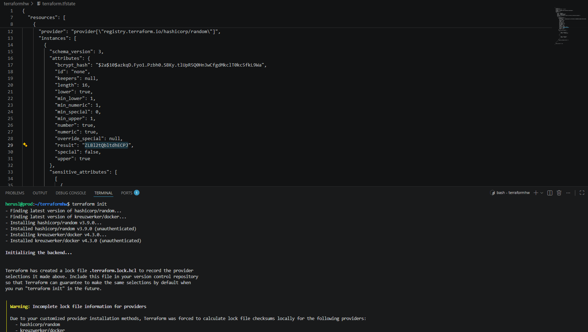
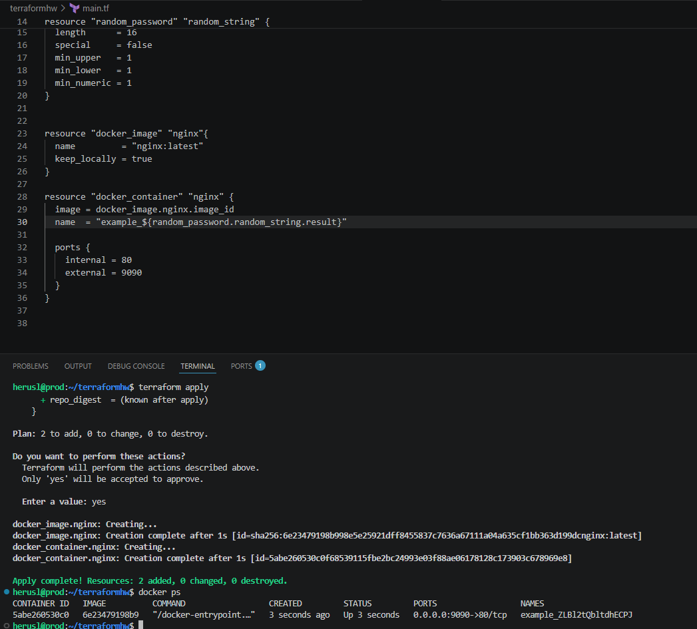
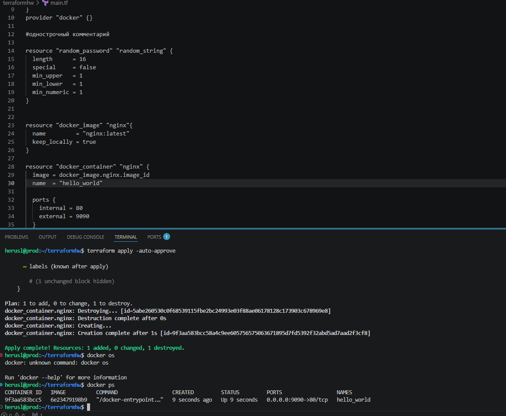
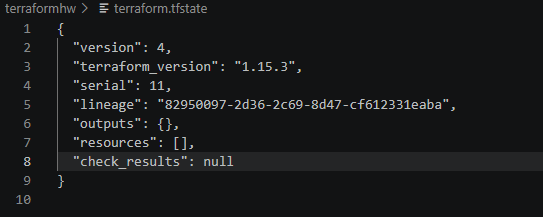

# Домашнее задание к занятию "`«terraform»`" - `grr`
### Задание 1

2. personal.auto.tfvars

3. 

4. Отсутствие имени ресурса докера. Имя ресурса не должно начинаться с цифры. Неверная ссылка на ресурс docker_image.nginx.image_id. Также неверная ссылка на random_password.

5.

6.

7.

8. keep_locally = true. 
keep_locally (Boolean) If true, the image will not be deleted when the resource is destroyed. Defaults to false.
