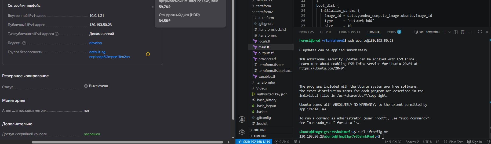
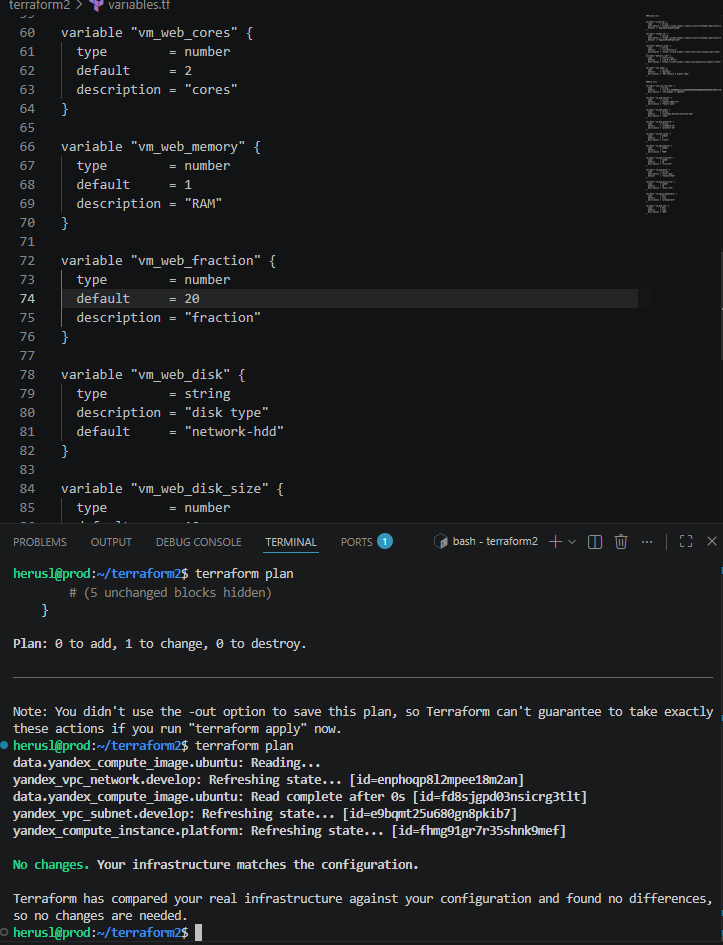
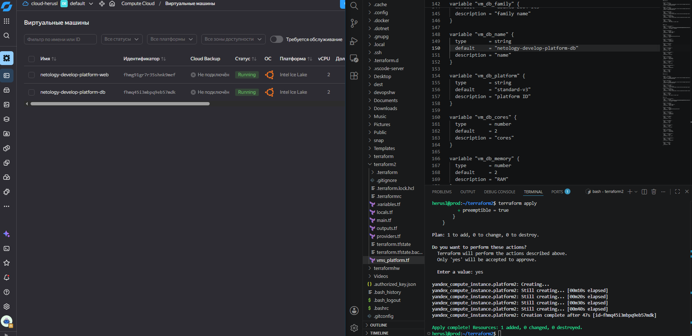
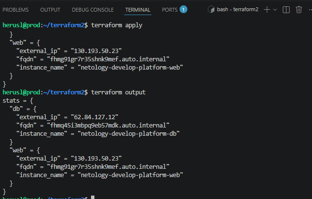
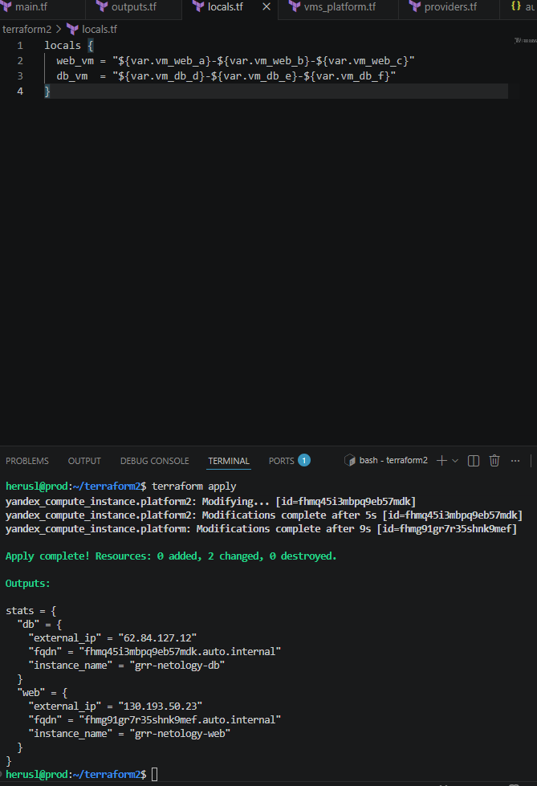
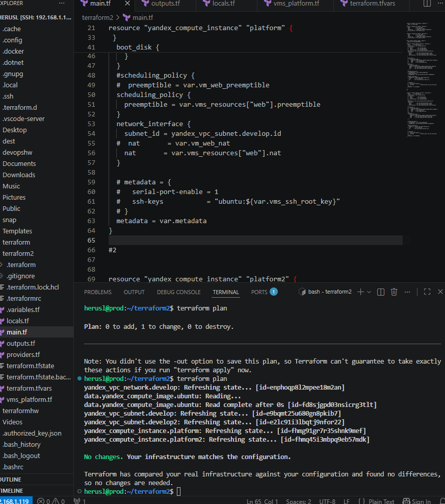

# Домашнее задание к занятию "`«Основы Terraform. Yandex Cloud»`" - `grr`

Залил сюда же итоговые конфиги до 6 задания, старый файл с переменными также оставил с именем variables

### Задание 1
Опечатка в standard, при указании версии платформы.
preemptible нужен для экономии ресурсов и подходит для тестовых машин, как лимит использования ядра core_fraction, также лимит можно использовать для низконагруженного сервиса по типу пайплайнов, тестовых задач и тп.

### Задание 2 

### Задание 3 

### Задание 4 

### Задание 5 

### Задание 6 

